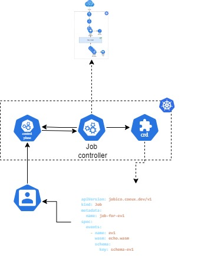
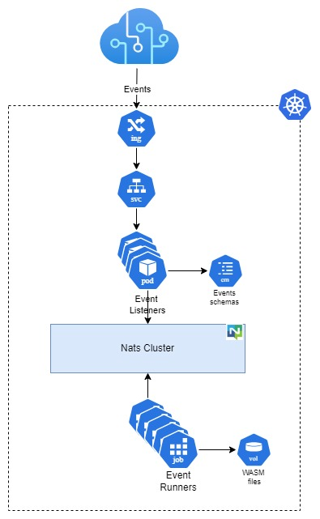

# Jobico for K8s
This project delves into integrating Jobico with Kubernetes. Jobico is a platform centered around events, allowing worker processes to be written in WebAssembly.

## Architecture

### Kubernetes Operator



### Events Processor



## CRD definition

```yaml
apiVersion: jobico.coeux.dev/v1
kind: Job
metadata:
  name: [Job's name]
spec:
  events:
    - name: [Event name]
      wasm: [WASM file to execute]
      schema:
        key: [ConfigMap containing the JSON schema definition]
```

### Example

```yaml
apiVersion: jobico.coeux.dev/v1
kind: Job
metadata:
  name: job-for-ev1
spec:
  events:
    - name: ev1
      wasm: echo.wasm
      schema:
        key: schema-ev1
```
## JSON schema ConfigMap

```yaml
apiVersion: v1
kind: ConfigMap
metadata:
  name: [Schema identifier]
data:
  [File name: Schema identifier.json]: |
    [Schema content]
```
### Example

```yaml
apiVersion: v1
kind: ConfigMap
metadata:
  name: schema-ev1
data:
  schema-ev1.json: |
    {
      "type": "object",
      "properties": {
          "firstName": {
              "type": "string"
          },
          "lastName": {
              "type": "string"
          },
          "age": {
              "type": "integer"
          }
      },
      "required": ["firstName", "lastName"]
    }
```

## Getting Started

### Using Jobico-cloud distribution
```bash
# 1- Creates a Kubernetes cluster with 2 nodes
$ git clone https://github.com/andrescosta/jobico-cloud.git
$ ./jobico-cloud/cluster.sh new

# 2- Compiles and deploys the Kubernetes Operator.
$ ./jobico-cloud/post/jobicok8s/main.sh .

# 3- Sends a simple event for processing
$ ./jobicok8s/hacks/test.sh
```
### Using Kind
```bash
# 1- Clone the project
$ git clone https://github.com/andrescosta/jobicok8s.git
$ cd jobicok8s 

# 2- Creates a Kubernetes cluster
$ make -f Makefile.kind kind

# 3- Compiles and deploys the Kubernetes Operator.
$ make deploy-all

# 4- Sends a simple event for processing
$ hacks/test.sh
```
### Prerequisites
- Go version v1.21.0+
- Docker version 17.03+.
- [GNU Make](https://www.gnu.org/software/make/) 
- SSH (only for Jobico-cloud)
- OpenSSL (only for Jobico-cloud)
- [Cloud-init](https://cloud-init.io/) (only for Jobico-cloud)
- [KVM](https://ubuntu.com/blog/kvm-hyphervisor) (only for Jobico-cloud)
- [Helm](https://helm.sh/) (only for Jobico-cloud)