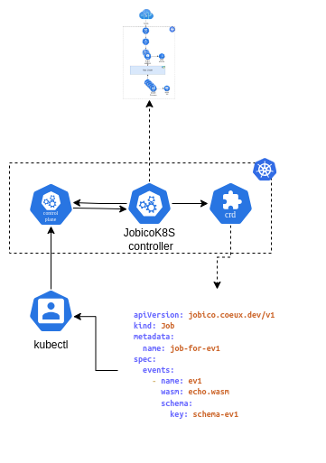

# Jobico for K8s
This project delves into integrating Jobico with Kubernetes. Jobico is a platform centered around events, allowing worker processes to be written in WebAssembly.

## Architecture

### Kubernetes Operator



### Events Processor


## Job definition

```yaml
apiVersion: jobico.coeux.dev/v1
kind: Job
metadata:
  name: [Job's name]
spec:
  events:
    - name: [Event name]
      wasm: [WASM file to execute]
      schema:
        key: [ConfigMap containing the JSON schema definition]
```

### Example

```yaml
apiVersion: jobico.coeux.dev/v1
kind: Job
metadata:
  name: job-for-ev1
spec:
  events:
    - name: ev1
      wasm: echo.wasm
      schema:
        key: schema-ev1
```
## JSON Schema definition

```yaml
apiVersion: v1
kind: ConfigMap
metadata:
  name: [Schema identifier]
data:
  [File name: Schema identifier.json]: |
    [Schema content]
```
### Example

```yaml
apiVersion: v1
kind: ConfigMap
metadata:
  name: schema-ev1
data:
  schema-ev1.json: |
    {
      "type": "object",
      "properties": {
          "firstName": {
              "type": "string"
          },
          "lastName": {
              "type": "string"
          },
          "age": {
              "type": "integer"
          }
      },
      "required": ["firstName", "lastName"]
    }
```

## Getting Started


### Prerequisites
- go version v1.21.0+
- docker version 17.03+.
- kubectl version v1.11.3+.
- Access to a Kubernetes v1.11.3+ cluster.

